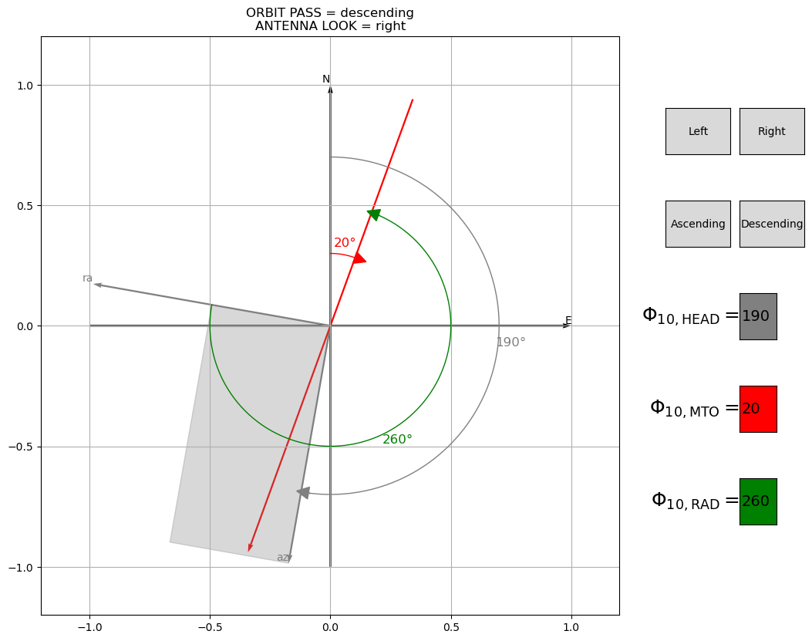

# sar_wind_direction

## Objective :

Tool to represent wind direction relatively to SAR antenna. The input direction is given in **Meteorological Convention** and the output is in **Radar Convention**. A reminder on conventions is written below examples.

> :warning: **Warning** : Tool is not over but is working perfectly for antenna pointing on the right with an ascending or descending pass. Only antenna pointing left is not well handled for now

## Examples :

## Wind Conventions Reminder:

There are two conventions for the wind direction:

- **Meteorological Convention:** In meteorology, wind direction is defined as the direction **from which** the wind is blowing. Angle rotation is clockwise. For example, a "north (resp. east) wind" is blowing from the north (resp. east) towards the south (resp. west). Corresponding value is 0° (resp 90°). This convention is commonly used in weather forecasts and reports.
- **Oceanographic Convention:** In oceanography, wind direction is defined as the direction **towards which** the wind is blowing. Angle rotation is clockwise. Foe example, a "north (resp. east) wind" in this context would be blowing from the south (resp. west) towards the north (resp. west). Corresponding value is 0° (resp 90°). This convention is more practical for understanding the effects of wind on ocean currents and waves.

The zonal and meridional wind components are expressed with , angle is given in radians such as :

- $u_\textrm{10,\textrm{MTO/OCE}} = U_\textrm{10}\cos(\Phi_{10,\textrm{MTO/OCE}})$,
- $v_\textrm{10,\textrm{MTO/OCE}} = U_\textrm{10}\sin(\Phi_{10,\textrm{MTO/OCE}})$,
- $\Phi_{10,\textrm{MTO/OCE}}= \tan^{-1}(u_{10,\textrm{MTO/OCE}},v_{10,\textrm{MTO/OCE}})$.

In practice, the radar measurements are related to the wind speed $U_{10}$ and the wind direction $\Phi_{10,\textrm{RAD}}$ which is expressed in the radar referencial. The radar referencial is defined by the

- **Azimuth Direction** : This is the horizontal direction, parallel to the Earth's surface, in which the sensor is moving. It's essentially the direction of flight or orbit $\Phi_{\textrm{HEAD}}$. In practice for SAR systems, it is also the direction in which the image is synthetized.
- **Ground Range Direction** : This is the direction of the line of sight between the radar and the target in which the radar waves are emitted, projected on ground.

These directions given in radians are related by the following relationship:

- **Radar to Meteorological** : $\Phi_{10,\textrm{RAD}} = \pi/2 - (\Phi_{10,\textrm{MTO}} - \Phi_{\textrm{HEAD}})$,
- **Meteorological to Radar** : $\Phi_{10,\textrm{MTO}} = \pi/2 - \Phi_{10,\textrm{RAD}} + \Phi_{\textrm{HEAD}}$,
- **Meteorological to Oceanography** : $\Phi_{10,\textrm{OCE}} = (\Phi_{10,\textrm{MTO}} + \pi) \textrm{ mod } 2\pi$,
- **Oceanography to Meteorological** : $\Phi_{10,\textrm{MTO}} = (\Phi_{10,\textrm{OCE}} - \pi) \textrm{ mod } 2\pi$.

In the **Radar Convention**, the wind direction is defined anti-clockwise from the range direction. Wind direction is the direction towards which the wind is blowing. For example when the wind is "upwind" i.e. $\Phi_{10,\textrm{RAD}}=0$, the wind is blowing toward the antenna in the range direction.

As for the meteorological/oceanographic conventions, wind components can be defined. They are termed range and azimuth components and defined such as :

- $u_{\textrm{10},\textrm{RAD}} = U_\textrm{10}\cos(\Phi_{10,\textrm{RAD}})$,
- $v_{\textrm{10},\textrm{RAD}} = U_\textrm{10}\sin(\Phi_{10,\textrm{RAD}})$,
- $\Phi_{10,\textrm{RAD}}= \tan^{-1}(u_{10,\textrm{RAD}},v_{10,\textrm{RAD}})$
- $U_{10} = \sqrt{u_{10,X}^2+v_{10,X}^2}$.
